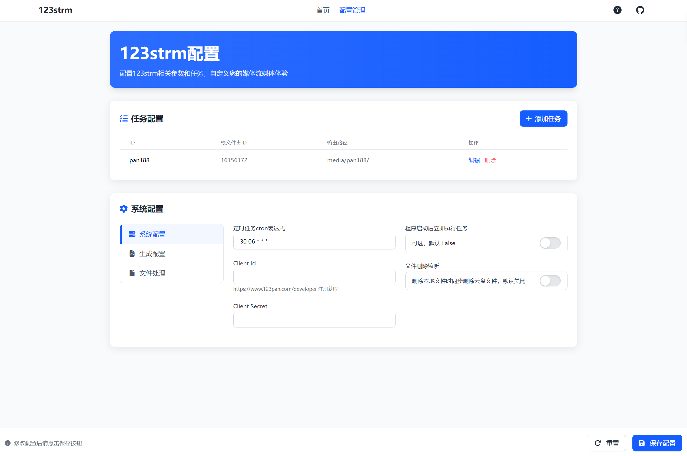
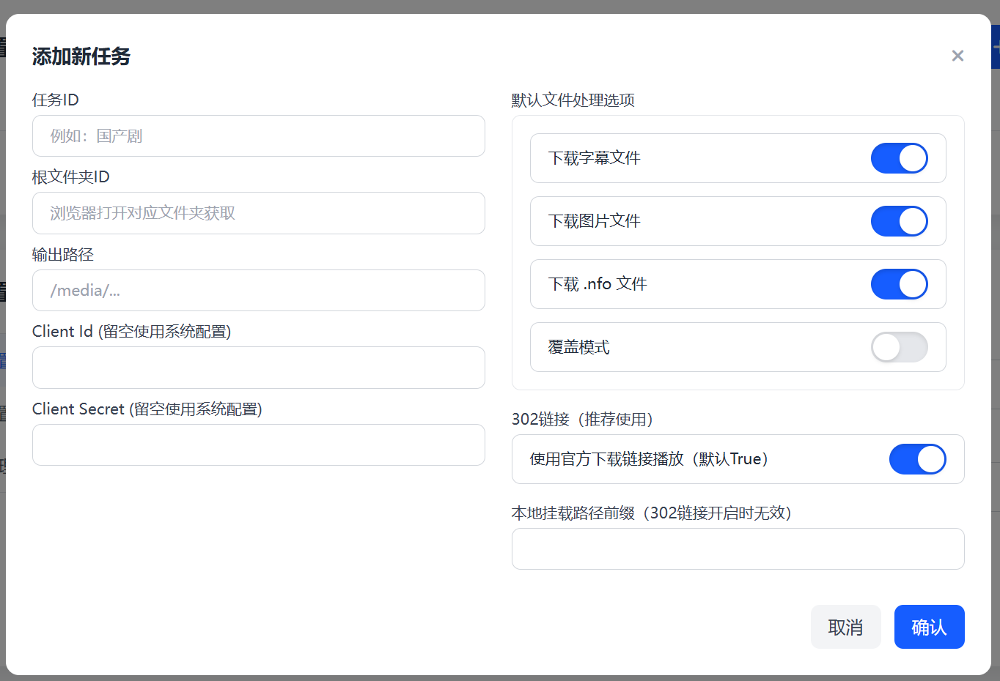
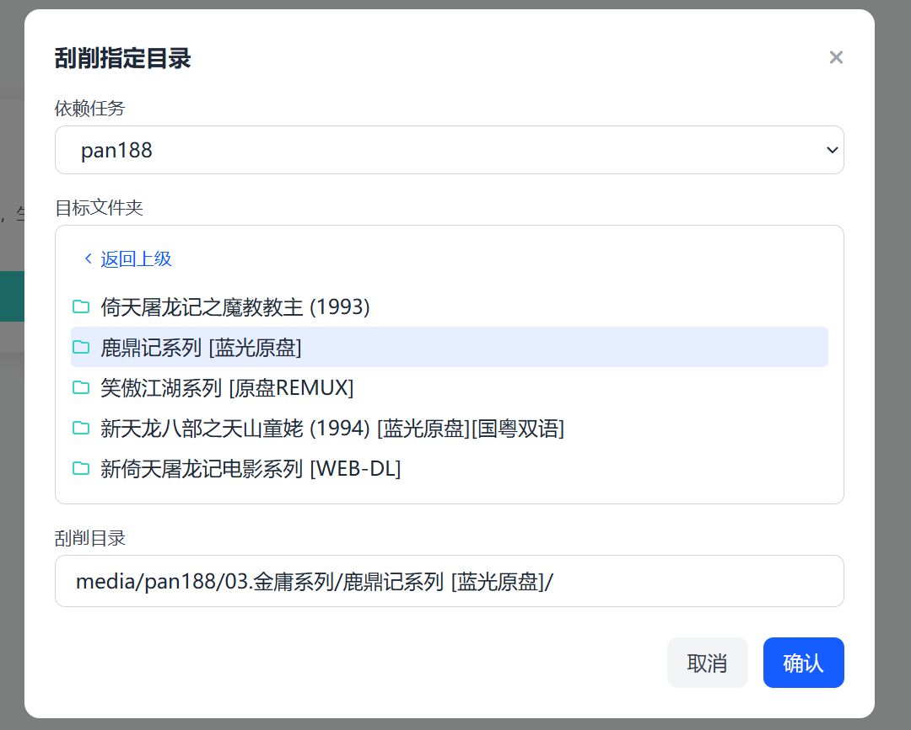
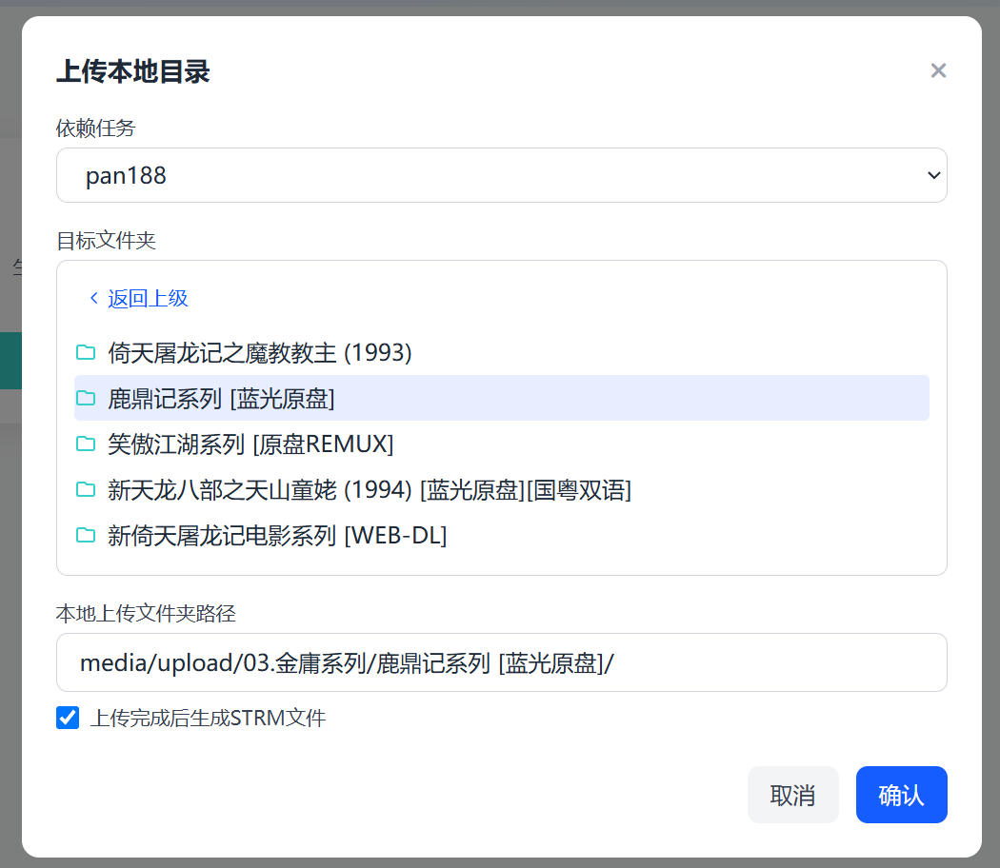

# 123strm 项目

## 项目简介

123strm 是一款专注于123网盘文件 strm 管理与生成的工具，支持可视化配置、定时自动生成 strm，还能上传本地文件至云盘并同步生成对应 strm，同时提供手动刮削功能，全方位简化 strm 相关操作流程。

## 功能特性

- 使用 123 云盘官方 api，安全可靠，不依赖第三方
- 单线程下载，不会触发风控
- 可配置海报、字幕、nfo 文件是否下载
- 自动清理本地不存在于 123 云盘的文件
- 支持 302 链接，观看时自动获取最新的文件链接，绿联影视中心支持外网访问
- 支持可视化配置，地址为 ip:1236
- 支持手动刮削指定云盘目录，用于刮削更新或修改的文件夹
- 支持上传本地目录，上传成功后会自动删除本地文件并生成 strm

## 预览









## 生成速度

生成 strm 的速度与网盘目录文件夹内包含的子文件夹数量成正相关，简略计算方式为

> 生成时间=刮削目录子文件夹数量/3/60 （分钟）

以我的网盘为例，500+的子文件夹生成时间稳定在 3 分钟出头，即 556/3/60=3.08 分钟

如果选择下载 nfo、图片等文件，在第一次生成时会极大影响生成速度，耐心等待即可，也可以按照网盘目录结构从已有的刮削数据迁移过来节省时间，当本地存在文件时不会重新下载。

## 安装指南

```bash
# 1. 克隆仓库
git clone <仓库地址>
# 2. 安装依赖
pip install -r requirements.txt
# 3. 运行脚本
python app/amin.py
# windows运行命令
python -m app.main
# 4. 访问可视化配置页面, 访问地址：http://127.0.0.1:1236
```

### 自行构建 docker 镜像

```bash
docker build -t 123strm . && docker save -o 123strm.tar 123strm && gzip 123strm.tar
# 生成docker镜像
docker build -t 123strm .
# 生成本地镜像包
docker save -o 123strm.tar 123strm
# 压缩镜像包减小体积
gzip 123strm.tar
```

### 使用教程

#### compose 部署

> ARM 架构请使用 `knifez/123strm:arm64` 镜像

```yml
services:
  123strm:
    image: knifez/123strm:latest
    container_name: 123strm
    network_mode: host
    volumes:
      - /volume1/docker/123strm/config:/app/config
      - /volume1/docker/123strm/media:/media
    restart: always
    working_dir: /app
    environment:
      PUID: "0"
      PGID: "0"
```
